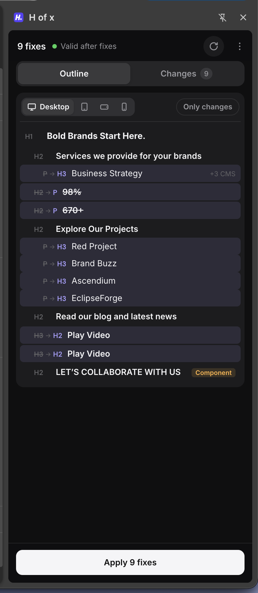
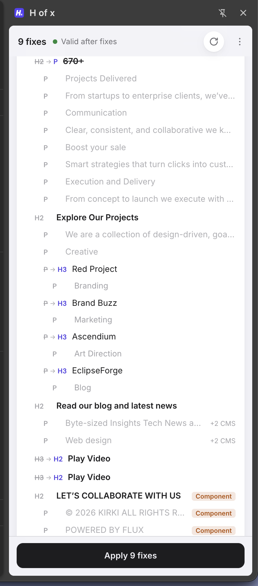
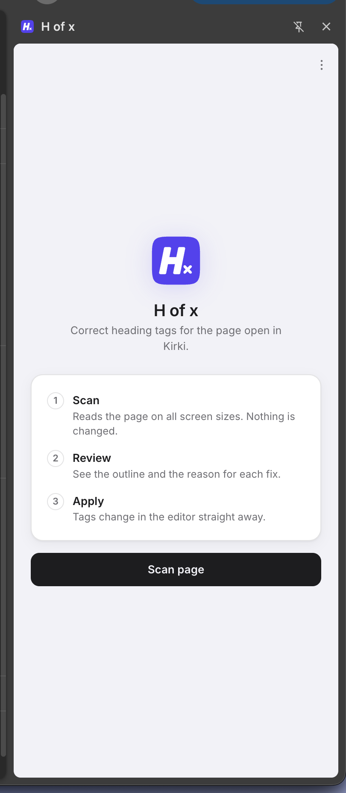

# H(x)


Fix the heading structure of a page in **Kirki** — scan it, review the suggested H1–H6 outline across every breakpoint, apply the tags on save.

Heading levels decide how a page reads to search engines and screen readers, and in a visual builder they drift out of order as the page grows. H(x) reads the rendered structure on all four canvases and proposes the outline the page should have had. Nothing is written until you review it.

### Screenshots

<div align="center">

</div>

*After a scan: the whole page structure for the chosen breakpoint. Struck-through tags are the current ones, violet is what H(x) suggests — `P → H3`, `H2 → P`. Then **Apply 9 fixes**.*

| Changes | Start |
|---|---|
|  |  |
| Only the rows that change, in reading order, with CMS items and components labelled. Light mode — it follows your system theme. | Before a scan: scan, review, apply. Nothing is touched until you say so. |

## Features
- **Review first:** every suggested change is a row you can retag, untick or skip.
- **All breakpoints:** desktop, tablet, landscape and mobile merged into one tag per element.
- **Safe write:** a one-shot hook rewrites the tag inside Kirki's own save request, then removes itself.
- **Rich text aware:** a heading with styled `<span>`s stays a single block.
- **Live checks:** the outline preview and problem list update as you edit, with no extra page calls.
- Light / dark / auto theme.

## Quick start
1. `chrome://extensions` → enable **Developer mode** → **Load unpacked** → select this folder.
2. Pin the extension and open a page in the Kirki editor.
3. Click the H(x) icon → **Scan page** → review → **Apply N fixes**, then **Save** in Kirki.

`localhost` is allowed by default. For a live domain, Chrome asks for access the first time you scan there.

Full step-by-step instructions: **[docs/USER_GUIDE.md](docs/USER_GUIDE.md)**.

## Documentation
- [User guide](docs/USER_GUIDE.md) — install, use, troubleshoot
- [Development](docs/DEVELOPMENT.md) — tests, fixtures, versioning, brand
- [How it works](docs/ARCHITECTURE.md) — scanning, the save hook, how levels are decided

## Development
```bash
npm i
npx playwright install chromium
npm test
```
